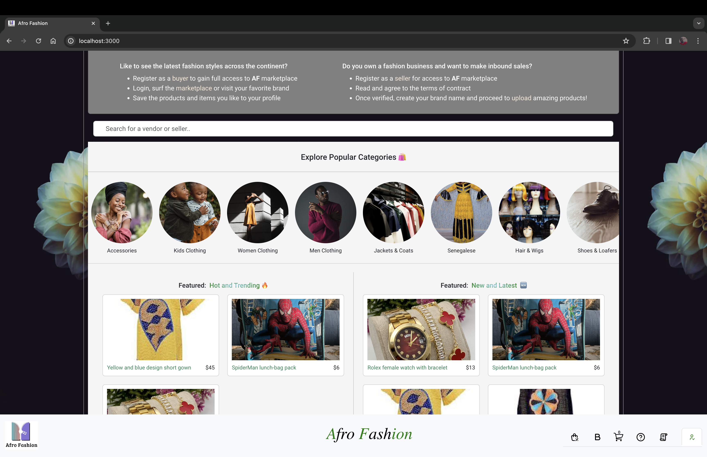
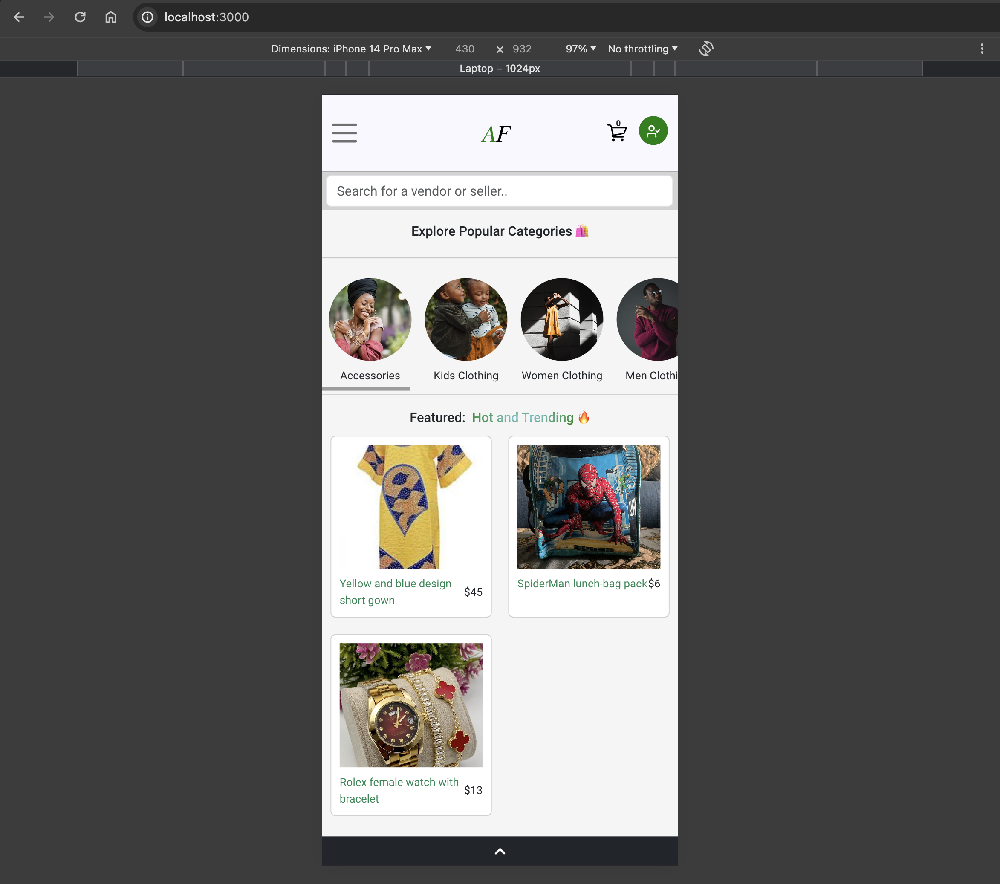
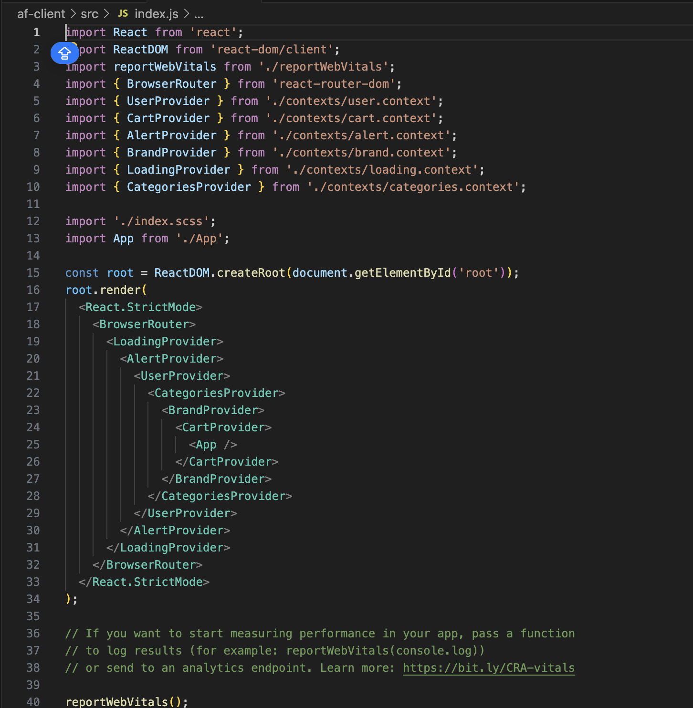

# Afro Fashion

- is an e-commerce application, aiming to be Africa's original fashion marketplace.
- This app is built on react.js + node.js, styled with custom scss and react-bootstrap.
- This app's node manager runs on npm v18, and has several lightweight dependencies like firebase.

## How to Start App

- Make sure you are in the correct working directory - `cd` into the client's root folder `Afro-fashion-main/af-client`
- To install the projects required packges and dependencies, run `npm install`.
- Once the packages are installed and your package.json file is updated, to start the app, run `npm start`
- This app would start on the `process.env.PORT` or the defaulted port: 3000 (unless modified).
- If you're not redirected to your browser to view this app, you can visit http://localhost:3000

Larger Screen Display:

Mobile Display:

## Render Structure

- The routing and UX of this app depends on the tree structure and data flow.
- The responsiveness and UI of this app depends on 2 screen sizes-- `lg` (often referred to as _Desktop_ throughout the App) and `sm` (_Mobile_).
- The rendering and component lifecycle of this app also depend on `react` and `react-router-dom.`
- Rewriting "create-react-app" default config, App.js is rendered inside the _index.js_ file like so;

  _import App from './App' ;_

  _ReactDOM.createRoot(document.getElementById('root')).render(_

- _<React.StrictMode>_
- `<BrowserRouter>`
- _`<AlertProvider>`_
- _`<UserProvider>`_
- _`<CategoriesProvider>`_
- _`<BrandProvider>`_
- _`<CartProvider>`_
- _`<LoadingProvider>`_
- _`<App />`_
- _`<LoadingProvider>`_
- `</CartProvider>`
- _`</BrandProvider>`_
- `</CategoriesProvider>`
- _`</UserProvider>`_
- `</AlertProvider>`
- _`</BrowserRouter>`_
- _</React.StrictMode>
  );_
- App is directly wrappped by LoadingProvider as it provides a great experience for user interactions.
- CartProvider stores a user's cart operations and readily dispatches to when called.
- BrandProvider stores and retrieves brand information, rendering a different context from categories.
- CartProvider is nested under CategoriesProvider and uses her context for the app data UI.
- CategoriesProvider is nested under UserProvider and uses her context for user-session-log.
- UserProvider is nested under BrowserRouter and uses her memory to navigate the entire app.
- BrowserRouter is rendered by React.StrictMode- StrictMode wraps and sets the component tree.

## Component Structure

The main components of this application can be found under the _src_ directory like so;

- src

  - components

    - > adSection
    - > assets
    - > buttons
    - > cartServices

      - > cart-content
      - > cart-dropdown
      - > cart-icon

      ***

    - > collection
    - > checkout
    - > directory
    - > products
    - > routes

      - > authentication
        >
        > - seller-auth
        > - sign-in
        > - sign-up
        > - user-auth
        >
        > ***
      - > brands
        >
        > - brands.route.jsx
        > - brands.styles.scss
        >
        > ***
      - > category
        >
        > - category.route.jsx
        > - category.styles.scxx
        > - mobile.category.routes.jsx
        >
        > ***
      - > credits
        >
        > - credits.jsx
      - > help
        >
        > - help-list-card
        > - help-list
        > - help.gram.jsx
        > - help.styles.scss
        >
        > ***
      - > index
        >
        > - lg.component.jsx
        > - mobile.component.jsx
        >
        > ***
      - > navbar
        >
        > - mobile.lg.navbar.component..jsx
        > - mobile.navdrop.jsx
        > - lg.navbar.component.jsx
        > - navbar.styles.scss
        > - side-nav.jsx
        >
        > ***
      - > seller
        >
        > - s-profile
        >   > 4+ components
        > - protected-route.jsx
        > - seller.component.jsx
        > - seller.styles.scss
        >
        > ***
      - > shop
        >
        > - mobile.shop.jsx
        > - shop.jsx
      - > user
        >
        > - profile-card.jsx
        > - protected-route.jsx
        > - user.component.jsx
        > - user.products.jsx
        > - user.styles.scss
        >
        > ***

      ***

  - contexts

    - > alert.context
    - > brand.context
    - > cart.context
    - > categories.context
    - > loading.context
    - > users.context

  - searchServices
  - utils

    - > config
    - > firebase.utils
    - > flutterwave.utils
    - > rate.utils
    - > writeBatch

- > App
- > App.test
- > index
- > index.scss
- > reportWebVitals
- > setupTests

## assets

The assets used include SVG elements that are integral and unique to the brand or consistency of the application's UI.

## buttons

The buttons hold .jsx and .scss components dynamically used and rendered throughout the application's UI.

## cartServices

The cartServices directory is a parent to cart components and functionality used and rendered throughout the application.

## collection

The collection holds .jsx and .scss components responsible for categorizing data for the application's UI.

## directory

The directory is a single, integral .jsx component responsible for reacting and rendering of the collection components.

## products

The products hold .jsx and .scss components dynamically used and rendered throughout the application's UI.

## routes

The routes directory is a parent to router components and routing functionalities rendered throughout the application.

## cart.context

The cart.context holds the context and providers for cart components and renders throughout the application.

## categories.context

The categories.context holds the context and value provider for data categories and renders throughout the application.

## users.context

The users.context holds the context and providers for user-session-log and renders throughout the application.

## firebase.utils

The firebase.utils hold configurations for firebase, firestore and google providers used as authentication in the application.

# Tech Stack

- React.js
- Node.js
- Bootstrap
- React-Bootstrap
- Firebase/firestore
- Google-Auth
- Materal-UI
- Netlify
- Github
- Jest (_testing_)

# Author: Gideon, I

## Contributors: Adeola, A
